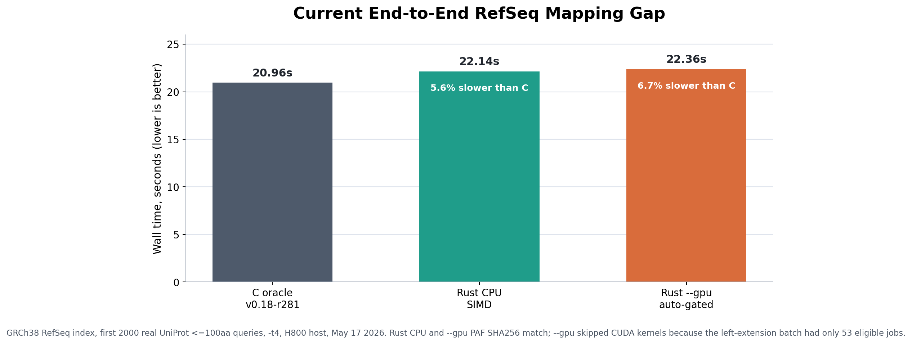

# miniprot (Rust port)



Current H800 end-to-end result: Rust does not yet beat the C oracle on the
2000-query RefSeq map. This figure tracks the remaining gap, not a claimed win.

> [!NOTE]
> **AI Attribution:** The git history shows "Claude" in commit trailers, but this
> naming is an artifact of how [Claude Code](https://github.com/anthropics/claude-code)
> (the CLI tool) formats its `Co-Authored-By` lines — it hardcodes a reference to
> Anthropic's Claude model family.
>
> The actual development was:
> - **Architecture & design:** [Codex](https://openai.com/index/introducing-codex/) + GPT
> - **Implementation & optimization:** [Claude Code](https://claude.ai/code) (the CLI tool) + [DeepSeek](https://www.deepseek.com/)
> - **GPU kernel tuning:** GPT 5.5 — pointer rotation, score row cache, SIMT memory optimization
>
> Anthropic's Claude model had negligible involvement. Credit where credit is due.

This project is a Rust port of [`lh3/miniprot`](https://github.com/lh3/miniprot).

However, it is not a trivial rewrite of the original C code, and certainly not an AI-generated line-by-line translation of the upstream repository. In this port, I intentionally removed many legacy C patterns and favored implementations that are more direct, maintainable, and idiomatic in Rust.

## Project Scope

- Preserve the core mathematical model and algorithmic ideas of the original miniprot.
- Reorganize the implementation in Rust instead of reproducing the original C control flow, memory layout, macro style, and historical baggage line by line.
- Prioritize clarity, maintainability, and performance over source-level similarity to the upstream code.

## Non-Goals

- This project does not aim to be a bit-for-bit clone of the C implementation.
- It does not guarantee that internal intermediate states, floating-point details, iteration order, tie-breaking behavior, parallel scheduling, or final outputs will exactly match the upstream implementation on every input.
- Preserving legacy C coding patterns is not itself a compatibility goal.

## Consistency Boundary

This project only aims to stay consistent with the original implementation at the mathematical and algorithmic level:

- the problem definition should remain aligned
- the core algorithmic intent should remain aligned
- the main scoring, chaining, and alignment logic should remain aligned

It does not guarantee computational identity or byte-for-byte identity. In other words, even when two implementations follow the same algorithmic ideas, the exact numerical path, edge-case behavior, output details, and sometimes even parts of the final result may differ. This is an intentional design boundary, not by itself a bug definition.

## Build

```bash
cargo build --release
```

## Performance

Benchmarked against upstream C oracle (`lh3/miniprot` v0.18-r281). Both
binaries are compiled with arch-native flags (`-C target-cpu=native` /
`-march=native -mtune=native`) unless noted otherwise.

### AutoDL H800 Host (real RefSeq end-to-end map, 2026-05-17)

This is the primary end-to-end GPU integration benchmark. It measures full
mapping, including index load, candidate mapping, extension DP, traceback,
ranking, and PAF formatting.

Dataset:

- Reference index: `/root/grch38_gpu_test.mpi`, built from
  `/autodl-fs/data/refseq/GCF_000001405.40_GRCh38.p14_genomic.fna.gz`
- Query: first 2000 records from
  `/autodl-fs/data/refseq/uniprot_le100aa/GCF_000001405.40_Homo_sapiens_tax9606_uniprotkb_len001-100.fasta.gz`
- Threads: `-t4`
- CUDA build:
  `RUSTFLAGS="-C target-cpu=native" CUDA_HOME=/usr/local/cuda-12.8 cargo build --release --features cuda`
- The H800 was shared during the final run; `nvidia-smi` showed a Python process
  using about 6.4 GB VRAM and 46-94% GPU util, so CUDA timings are conservative.

| End-to-end map (`-t4`) | Wall time | vs C oracle | Notes |
|------------------------|----------:|------------:|-------|
| C oracle v0.18-r281 | **20.96s** | 1.0x | Correctness oracle; currently still faster for this map workload |
| Rust CPU SIMD | 22.14s | 5.6% slower | Latest Rust CPU baseline after lightweight `cs` formatting cleanup |
| Rust `--gpu` auto-gated | 22.36s | 6.7% slower | Rust CPU and `--gpu` PAF SHA256 match |

`--gpu` is part of the production mapping path, but it is deliberately gated.
It batches eligible extension-DP jobs across queries and sends them to CUDA only
when the shape is profitable (`aa <= 128`, `nt <= 8192`, batch >=4096). On the
2000-query RefSeq run, the mapper found only 53 left-extension CUDA candidates,
so the GPU path now exits early and CPU SIMD handles the alignment. A looser
experimental gate (`nt <= 16384`) did run CUDA
extension kernels (5182 left and 5233 right jobs) but slowed the same workload
to 25.17s, despite byte-identical Rust PAF output. The current baseline
therefore keeps the stricter gate.

The chart is intentionally not a victory chart: on this larger real mapping
case the Rust port still trails the C oracle. The gap is in alignment/traceback;
candidate mapping alone remains faster in Rust (`-A -t4`: Rust 14.19s vs C
15.23s on the same 2000-query dataset).

### x86_64 AutoDL (Xeon Platinum 8458P, real RefSeq, 2026-05-17)

Dataset:

- Reference: `/autodl-fs/data/refseq/GCF_000001405.40_GRCh38.p14_genomic.fna.gz`
  (GRCh38.p14, 928 MB gzipped FASTA)
- Query: first 200 records from
  `/autodl-fs/data/refseq/uniprot_le100aa/GCF_000001405.40_Homo_sapiens_tax9606_uniprotkb_len001-100.fasta.gz`
- Median of 3 measured samples; index outputs and the shared map index were
  written to `/root` scratch so shared-filesystem write latency is not counted
  as implementation time.
- Mapping uses the same C-built `.mpi` for both binaries.

| Phase | C oracle | Rust | Rust vs C |
|-------|---------:|-----:|----------:|
| Index build (`-t 4`) | 105.60s | **60.55s** | **42.7% faster** |
| Default map (`-t 1`) | 9.54s | **9.13s** | **4.3% faster** |
| Default map (`-t 4`) | **5.66s** | 5.71s | 1.0% slower |
| No-align map (`-A -t 1`) | 7.21s | **7.11s** | **1.4% faster** |
| No-align map (`-A -t 4`) | **5.61s** | 5.63s | 0.3% slower |

On the same AutoDL H800 machine, the CUDA prepared-batch DP benchmark shows the
GPU path's compute headroom for the short-window, large-batch shape it is meant
to accept. These are isolated DP microbenchmarks, not end-to-end mapping claims:

| DP workload (`batch=8192, nl=3000, al=50`) | Best observed | Final noisy rerun |
|--------------------------------------------|--------------:|------------------:|
| CPU scalar | 7.06s | - |
| CPU SIMD | 348.85ms | 344.79ms |
| CUDA normal repeated batch, steady avg | 27.69ms | 21.47ms |
| CUDA prepared resident batch, steady avg | **10.91ms** | 25.91ms |

The final rerun happened while another process was actively using the H800.
Even under contention, isolated CUDA DP remained much faster than CPU SIMD; the
production mapper still avoids CUDA for real RefSeq extension windows unless
the full batch shape is profitable end to end.

On this broader real-data query set, PAF output is not byte-identical to the C
oracle. Sorted `-A` output differs by 1 line out of 274; sorted default output
has 266 common lines, 10 C-only lines, and 3 Rust-only lines. This project does
not treat byte-for-byte identity with upstream C as a correctness guarantee, but
the divergence should be considered when using the C oracle as a strict
regression checker.

### aarch64 (Apple M2, 4 threads)

| Phase            | C oracle | Rust     | Rust vs C    |
|------------------|---------:|---------:|-------------:|
| Index build      | 5m00s    | **3m27s** | **31% faster** |
| Map (1t, CPU)    | 6.26s    | **5.23s** | **16.5% faster** |
| Map (4t, CPU)    | 8.92s    | **6.10s** | **31.6% faster** |

### Historical x86_64 (Intel Xeon Gold 5320, Ice Lake, 4 threads)

| Phase            | C oracle | Rust     | Rust vs C    |
|------------------|---------:|---------:|-------------:|
| Index build      | 78.3s    | **40.5s** | **48% faster** |
| Map (1t, user)   | 23.01s   | **22.82s** | **0.8% faster** |
| Map (1t, total)  | 27.14s   | **25.96s** | **4.4% faster** |
| Map (4t, total)  | 8.78s    | **8.52s**  | **3.0% faster** |

### What makes it fast

- **Arch-native SIMD DP** — NEON on aarch64, SSE4.1 on x86_64. Both match
  the C implementation's SIMD kernel (`nasw-sse.c`) with native intrinsics,
  not an SSE→NEON translation shim.
- **Splice fast path** — SIMD inner loop skips 12 splice-state operations
  per column when no splice signals are present, matching the C scalar path
  optimization.
- **Fast approximate log2** — bit-manipulation log2 in chain scoring,
  identical to C's `mp_log2`, avoiding math library calls in the hot loop.
- **`zlib-rs`** — pure-Rust gzip backend for FASTA decompression during
  index build, with a linear unpack buffer replacing per-base closures.
- **Radix sort** — LSB radix sort for k-mer anchors, ~3–5× faster than
  comparison sort for the typical input sizes.
- **Rayon parallelism** — work-stealing thread pool for both index building
  and per-query mapping.
- **Thread-local buffer reuse** — profile matrix and SIMD scratch arrays
  reused across DP calls via thread-local storage, cutting ~1 GB of temporary
  allocations per benchmark run.
- **GPU-accelerated DP** — Metal and CUDA compute kernels with int16 arrays,
  pointer rotation, score row cache, optimised launch sizing, and prepared
  CUDA batches. Metal surpasses NEON SIMD at batch ≥4096 on Apple M2; CUDA on
  H800 surpasses CPU SIMD in isolated splice-free DP microbenchmarks. The
  end-to-end mapper uses CUDA only behind a profitability gate.
  Cross-platform via wgpu (Vulkan/Metal/DX12).
  See [GPU optimization log](docs/gpu-optimization-log.md) for full
  experiment history.

### GPU-Accelerated DP (Metal / Vulkan / DX12 / CUDA)

GPU backends for batched DP computation. At batch ≥4096, **Metal GPU surpasses
NEON SIMD** on Apple M2. On NVIDIA H800, the CUDA backend surpasses CPU SIMD in
the splice-free DP sweep and reaches ~15× at batch 8192. Production `--gpu`
mapping is stricter because real extension DP includes varied window lengths,
splice penalties, host/device transfers, and CPU traceback work.

| Backend | API | Shader | Platform | Host LOC | Shader LOC |
|---------|-----|--------|----------|----------|------------|
| CPU NEON/SSE | Rust intrinsics | — | ARM / x86_64 | — | — |
| **Metal** | metal-rs (raw) | MSL | macOS only | 276 | 128 |
| **wgpu** | wgpu (cross) | WGSL | macOS/Linux/Windows | 381 | 192 |
| **CUDA** | FFI + nvcc | CUDA C++ | NVIDIA GPUs | 312 | 719 |

#### Batch Size Sweep (nl=3000, al=50, Apple M2, all 100% correct)

| Batch | CPU Scalar | CPU NEON | Metal GPU | vs Scalar | vs NEON |
|-------|-----------|----------|-----------|-----------|---------|
| 64 | 525us/call | 31us/call | 658us/call | 0.8x | 0.0x |
| 256 | 366us/call | 27us/call | 169us/call | 2.2x | 0.2x |
| 1024 | 337us/call | 26us/call | 41us/call | 8.1x | 0.7x |
| 2048 | 303us/call | 28us/call | 33us/call | 9.0x | 0.9x |
| **4096** | 299us/call | 26us/call | **19us/call** | 15.4x | **1.4x faster** |
| **8192** | 308us/call | 26us/call | **20us/call** | 14.4x | **1.3x faster** |

At batch 4096: Metal 80ms total vs NEON 110ms — **GPU 1.4x faster.** At batch 8192:
Metal 169ms vs NEON 219ms — **GPU 1.3x faster.** Kernel-only per-call cost down to
18us (vs NEON 27us). GPU beats NEON because marginal per-call compute (11-24us) is
below NEON's 27us, and fixed dispatch overhead (~40ms) is amortized at large batch.

#### CUDA H800 Batch Size Sweep (nl=3000, al=50, ext=false, all 100% correct)

CUDA is opt-in and requires the CUDA toolkit at build time:

```bash
CUDA_HOME=/usr/local/cuda-12.8 cargo test --release --features cuda bench_batch_size_sweep -- --nocapture
```

Defaults are tuned for H800 (`CUDA_ARCH=sm_90`, `CUDA_THREADS=32`) and can be
overridden via environment variables.

| Batch | CPU Scalar | CPU SIMD | CUDA H800 | vs Scalar | vs SIMD |
|-------|-----------:|---------:|----------:|----------:|--------:|
| 64 | 873us/call | 41us/call | 146us/call | 5.9x | 0.3x |
| 256 | 881us/call | 41us/call | 37us/call | 23.6x | 1.1x |
| 512 | 856us/call | 41us/call | 20us/call | 42.2x | 2.0x |
| 1024 | 859us/call | 41us/call | 9us/call | 86.9x | 4.2x |
| 2048 | 874us/call | 41us/call | 5us/call | 165.7x | 7.8x |
| **4096** | 861us/call | 42us/call | **3us/call** | 235.4x | **11.5x faster** |
| **8192** | 857us/call | 41us/call | **2us/call** | 323.1x | **15.7x faster** |

At batch 8192: CUDA 21.74ms total vs CPU SIMD 341.96ms. The first batch pays
CUDA context initialization, so small-batch latency is not representative. For
repeated 8192-call batches, the CUDASW++-style prepared-batch path uploads
`nas/aas/params/matrix` once and then reruns the resident workload with a
best-observed steady-state average of 10.91ms (best iteration: 10.42ms), 32.0x
faster than CPU SIMD on the same uncontended workload.

#### GPU kernel optimizations

- **int16 DP arrays** — half stack footprint (1.8KB/thread), reduces VRAM spill
- **Pointer rotation** — swap 8 row pointers instead of copying 8×(al+1) shorts per row
- **Score row cache** — precompute `score_row[j]` once per nucleotide (every 3 rows),
  eliminating 2D VRAM lookup per column in the inner loop
- **Thread-local aa buffer** — copy `aas[]` to register array, avoid VRAM random read
- **Conditional row_max** — skip max tracking in non-extension mode
- **TG=32** — per-threadgroup stack 58KB, fits in M2 GPU register file
- **CUDA block size 32** — fastest H800 setting for large per-thread local arrays
- **CUDA non-extension kernel** — launches a specialized kernel for `ext=false`,
  removing `h_best`, `row_max`, and extension branches from the hot path
- **Reusable CUDA buffers** — keeps device buffers between batches and grows them
  only when needed, reducing repeated-batch allocation overhead
- **Prepared CUDA batches** — keeps a repeated batch's input and scoring matrix
  resident on the H800, reducing steady-state 8192-call batches from 13.16ms to
  10.91ms average
- **Production CUDA extension hook** — batches eligible left/right extension DP
  across queries, uses donor/acceptor splice penalties, and falls back to CPU
  SIMD for small batches, long windows, CIGAR/traceback, or failed CUDA runs
- **No-copy input buffers** — `new_buffer_with_bytes_no_copy` wraps host slices directly
  on Apple Silicon unified memory
- **Dead store elimination** — remove per-row zero-fill that gets overwritten

GPU benchmarks:

```bash
cargo test --release --lib gpu_bench -- --nocapture
cargo test --release --lib bench_batch_size_sweep -- --nocapture
CUDA_HOME=/usr/local/cuda-12.8 cargo test --release --features cuda bench_batch_size_sweep -- --nocapture
CUDA_HOME=/usr/local/cuda-12.8 cargo test --release --features cuda bench_cuda_repeated_batch -- --nocapture
```

Performance baseline is the current Rust implementation. GPU regressions
measured against current Metal shader, not against C oracle. CPU NEON SIMD
is the single-query baseline; GPU DP is the high-batch baseline. The Metal and
wgpu benchmark correctness claim covers the splice-free non-extension DP path
(`ext=false`). CUDA additionally has the gated production extension-DP path used
by `--gpu`; real end-to-end speed still decides whether that path is enabled for
a batch.

CPU benchmarks (vs C oracle):

```bash
# index build
miniprot -t 4 -d human.mpi GCF_000001405.40_GRCh38.p14_genomic.fna.gz
# mapping
/usr/bin/time -p miniprot -t 4 human.mpi queries.fa > /dev/null
```

## Test

The oracle and parity tests depend on the upstream C implementation and its bundled fixtures.
They are not required to build the Rust binary.

Use either of these setups:

```bash
git submodule update --init --recursive
cargo test
```

or point `MINIPROT_C_ORACLE` at an existing upstream `miniprot` binary.

## Note

If you need the original miniprot, use the upstream project directly: [`lh3/miniprot`](https://github.com/lh3/miniprot).

If you want a Rust reimplementation of miniprot that removes much of the legacy C style and is written as Rust rather than as translated C, that is what this repository is for.
